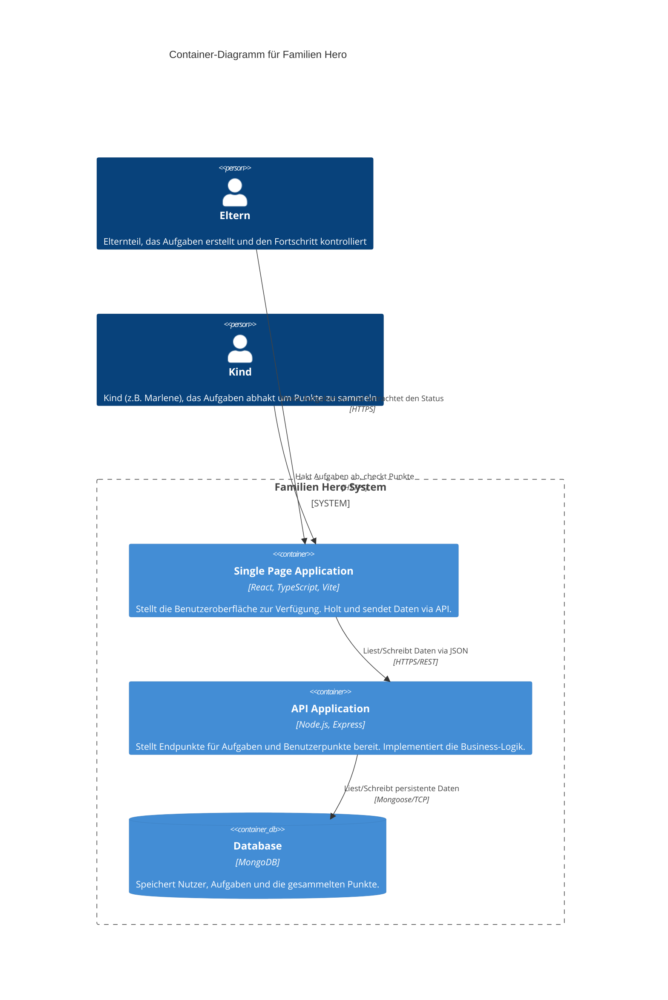
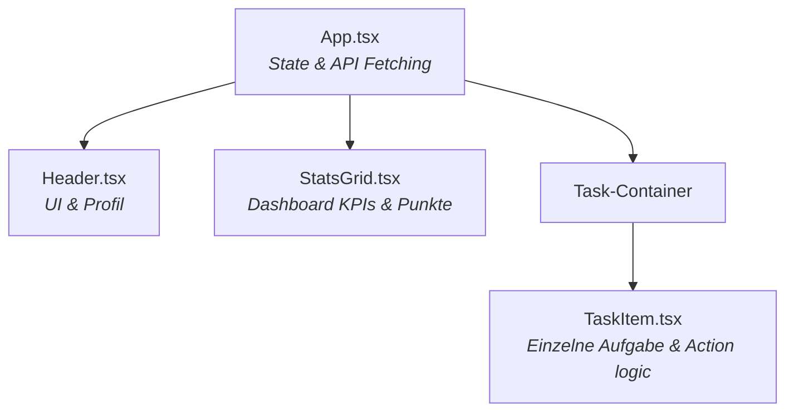

# Softwarearchitektur: Familien Hero

Dieses Dokument beschreibt die Architektur der "Familien Hero" Anwendung anhand eines simplen **C4-Container-Diagramms**. Es eignet sich optimal für die Präsentationsfolien.

## Systemarchitektur (Container)

Die Anwendung ist als klassische MERN-Stack (MongoDB, Express, React, Node.js) Webanwendung konzipiert.

## Komponentenübersicht (Frontend)

Die Vue/React Applikation wurde im Sinne einer besseren Wartbarkeit strukturiert:

