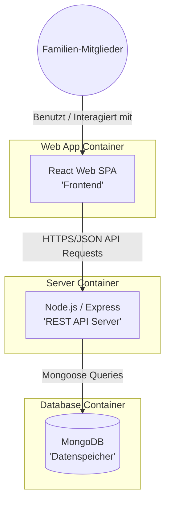
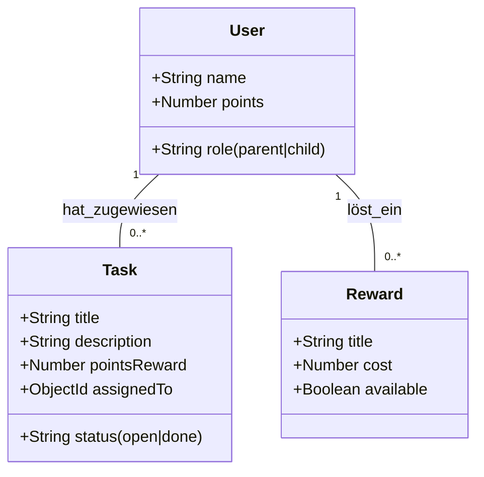

# Softwarearchitektur: Familien Hero

Dieses Dokument beschreibt die technische Struktur der "Familien Hero"-Anwendung nach dem **C4-Modell (Level 2: Container)**.

## 1. System-Kontext
Die Anwendung dient Familien zur Organisation von Aufgaben. Sie interagiert direkt mit den Familienmitgliedern und nutzt eine persistente Datenbank zur Speicherung von Zuständen.

## 2. Container-Diagramm (Level 2)

### Beschreibung der Container:
- **React Web SPA:** Die Single Page Application ist der primäre Einstiegspunkt für den Nutzer. Sie wird im Browser ausgeführt und verwaltet den UI-State sowie die Kommunikation mit dem Backend.
- **Node.js / Express API:** Das Backend validiert Anfragen, verarbeitet die Geschäftslogik (z.B. Punkteberechnung bei Aufgabenerledigung) und kommuniziert mit der Datenbank.
- **MongoDB:** Speichert persistent Nutzerdaten, Aufgaben-Definitionen, erledigte Aufgaben und den Punktestand.

## 3. Datenmodell (ER-Diagramm / UML)

## 4. Technologie-Begründung
- **SPA (Single Page Application):** Gewährleistet eine flüssige Benutzererfahrung (User Experience) ohne ständiges Neuladen der Seite, was besonders für die Gamification-Elemente wichtig ist.
- **NoSQL (MongoDB):** Bietet die nötige Flexibilität für zukünftige Erweiterungen (z.B. neue Aufgabentypen oder Achievement-Systeme), ohne starre Schema-Migrationen.
- **Node.js:** Ermöglicht die Verwendung von TypeScript über den gesamten Stack (End-to-End Type Safety), was die Fehleranfälligkeit reduziert.
