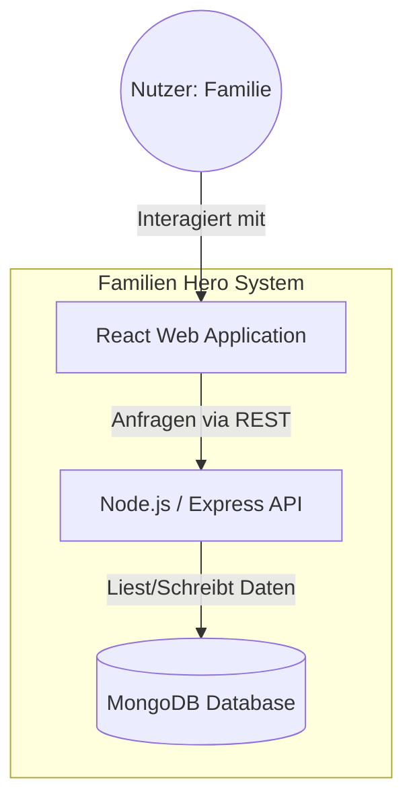

# Projektkonzept: Familien Hero

## 1. Problemstellung & Motivation
In vielen modernen Haushalten stellt die faire Verteilung von Alltagsaufgaben (Chores) eine ständige Herausforderung dar. Oft fehlt es insbesondere Kindern an extrinsischer Motivation, sich an Hausarbeiten zu beteiligen. Eltern wiederum empfinden das ständige "Ermahnen" als belastend (Mental Load). Es fehlt ein transparentes, motivierendes System, das Haushaltspflichten in spielerische Ziele ("Helden-Taten") verwandelt und Fortschritte sichtbar macht.

## 2. Zielgruppen
- **Eltern (Administratoren):** Sie definieren Aufgaben, legen Punktewerte fest und verwalten das Belohnungssystem.
- **Kinder (Helden):** Die primären Nutzer der Anwendung, die durch das Erledigen von Aufgaben Punkte sammeln, um diese gegen vordefinierte Belohnungen einzulösen.
- **Die gesamte Familie:** Profitiert von einer harmonischeren Aufgabenverteilung und erhöhter Transparenz.

## 3. Nutzen & Vorteile
- **Gamification:** Durch das Punktesystem wird die intrinsische Motivation gesteigert. Aufgaben werden als "Missionen" wahrgenommen.
- **Transparenz:** Jederzeit ist ersichtlich, wer welche Aufgaben erledigt hat und wie nah man seinem persönlichen Ziel (z.B. einem neuen Spielzeug) ist.
- **Lerneffekt:** Kinder lernen spielerisch den Zusammenhang zwischen Arbeit (Aufgabe) und Belohnung (Punkte) kennen.
- **Entlastung:** Weniger Diskussionen über Haushaltsaufgaben durch klare Zuständigkeiten.

## 4. Softwarearchitektur (C4 Model - Level 2: Container)
Die Webanwendung ist als moderner Fullstack-MERN-Ansatz konzipiert.

### Komponenten-Übersicht:
1. **Frontend (SPA):** Entwickelt mit React.js und TypeScript. Bietet eine reaktionsschnelle Oberfläche für Dashboard, Aufgabenliste und Shop.
2. **Backend (API):** Node.js Server mit Express. Stellt REST-Endpunkte für die Verwaltung von Nutzern, Aufgaben und Belohnungen bereit.
3. **Datenbank (MongoDB):** NoSQL-Datenbank zur flexiblen Speicherung von Dokumentstrukturen (Tasks, Users, Rewards).

## 5. Kernfunktionalitäten
- **Dashboard:** Zentrale Übersicht über offene Aufgaben, den API-Status und den LEGO-Fortschritt als Familienziel.
- **Helden-Profile (Hero-Switch):** Ein personalisierter Zugang für jedes Familienmitglied (Stefan, Alexandra, Marlene) mit individuellen Punkteständen.
- **Rollenbasierte Ansichten:** 
    - **Eltern (Admins):** Volle Kontrolle über die Aufgabenerstellung und -zuweisung.
    - **Kinder (Helden):** Fokus auf Missionen und Belohnungen (eingeschränkte Admin-Rechte).
- **Aufgabenmanagement:** Dynamische Erstellung und Zuweisung von Haushaltsmissionen.
- **Belohnungsshop:** Einlösen gesammelter Sterne gegen konfigurierbare Belohnungen.
- **Gamification-Elemente:** Visuelle Fortschrittsbalken und Star-Badges zur Steigerung der Motivation.

---
**Zusammenfassend:** "Familien Hero" verwandelt Alltagsroutine in ein gemeinschaftliches Abenteuer und entlastet die Kommunikation innerhalb der Familie.
