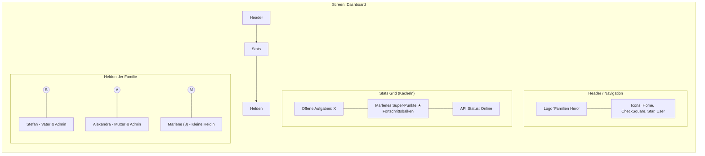
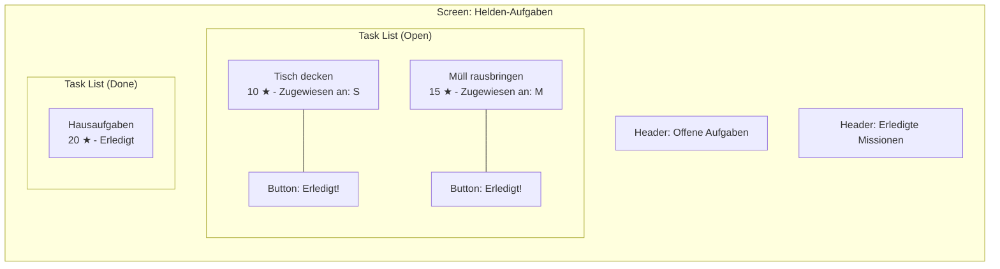
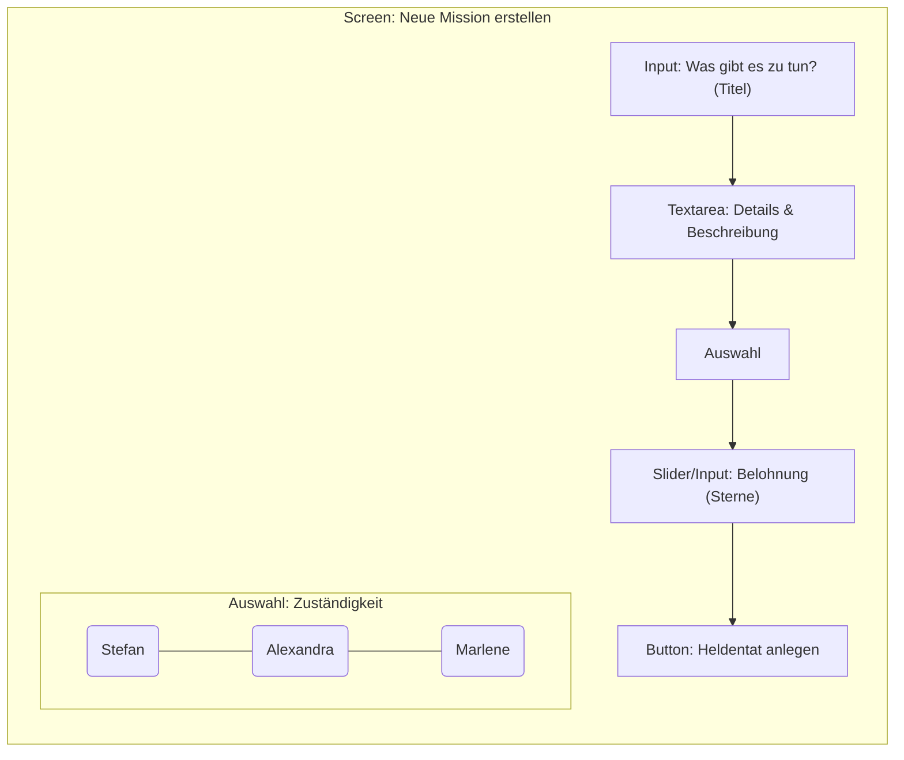
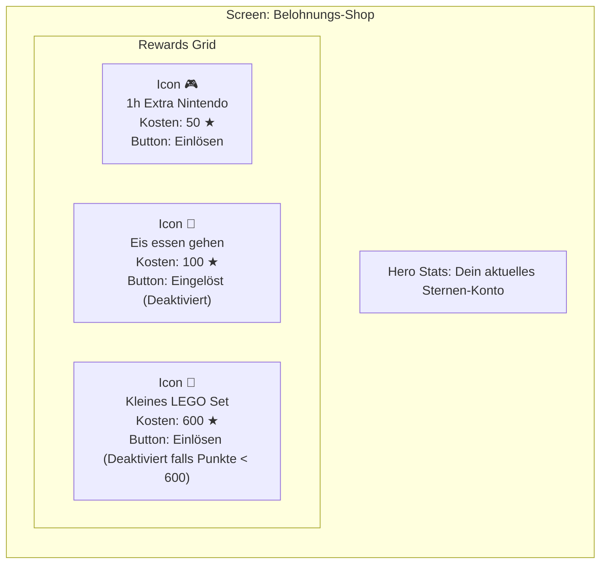
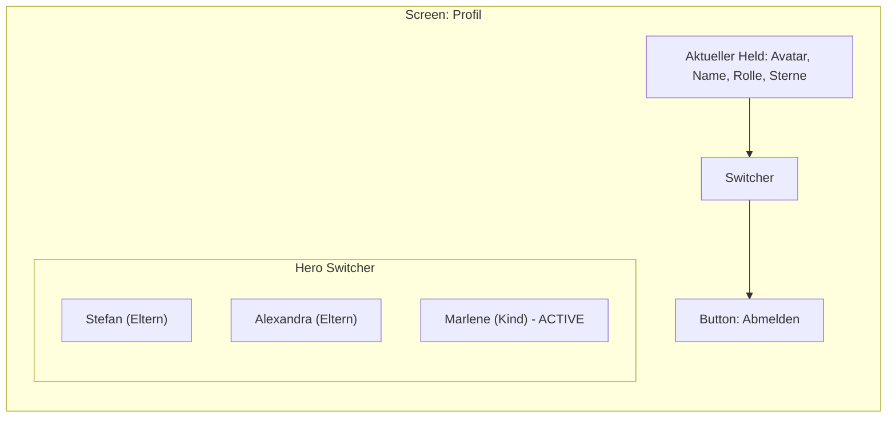

# Wireframes & UI-Design: Familien Hero

Dieses Dokument visualisiert die konzeptionellen Oberflächen der Anwendung "Familien Hero" in ihrem aktuellen Implementierungsstand. Der Fokus liegt auf einer intuitiven, spielerischen Benutzeroberfläche (Gamification) im "Glassmorphism"-Stil.

## 1. Dashboard (Hauptansicht)
Das Dashboard bietet eine schnelle Übersicht über alle relevanten Kennzahlen und Familienmitglieder.

### Kern-Elemente:
- **Stats Grid:** Drei Kacheln für offene Aufgaben, den Punktestand des Kindes inkl. Fortschrittsbalken und den Backend-Verbindungsstatus.
- **Helden-Liste:** Eine Übersicht aller registrierten Familienmitglieder.
- **Glassmorphism:** Alle UI-Elemente nutzen halbtransparente Hintergründe mit Blur-Effekten.

---

## 2. Aufgaben-Übersicht (Tasks)
Eine Liste aller existierenden Aufgaben, aufgeteilt in offene und bereits erledigte Missionen.

---

## 3. Aufgaben erstellen (TaskCreate)
Hier können Eltern (Admins) neue Aufgaben für die Kinder anlegen.

---

## 4. Belohnungsshop (Rewards)
In diesem Bereich können die gesammelten Punkte "ausgegeben" werden.

---

## 5. Profil & Helden-Wechsel (Profile)
Verwaltung des aktuellen Benutzers. Da Tablets oft geteilt werden, gibt es hier einen schnellen Profilwechsel (ähnlich Netflix).

---

## 6. Design-Vorgaben & UI-Tokens
- **Styling-Ansatz:** Reines CSS (Glassmorphism) ohne Tailwind, definiert in `index.css`.
- **Farbpalette:** 
  - Hintergrund: Dunkler Mesh-Gradient (Violett/Blau/Schwarz).
  - Primary: Indigo (`#6366f1`).
  - Secondary/Accent: Violett (`#8b5cf6`), Pink (`#ec4899`), Bernstein (`#f59e0b`).
- **Typography:** System-Fonts (`Inter`, `system-ui`) für maximale Performance und Lesbarkeit.
- **Komponenten:** Stark abgerundete Ecken (`border-radius: 20px`), subtile Rahmen (`border: 1px solid rgba(...)`) und Drop-Shadows.
