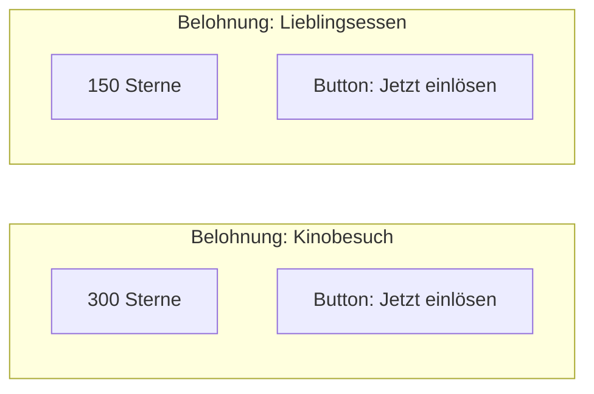

# Wireframes & UI-Design: Familien Hero

Dieses Dokument visualisiert die geplanten Oberflächen der Anwendung "Familien Hero". Der Fokus liegt auf einer intuitiven, spielerischen Benutzeroberfläche (Gamification).

## 1. Dashboard (Hauptansicht)
Das Dashboard bietet eine schnelle Übersicht über alle anstehenden Aufgaben und den Fortschritt der Familienmitglieder.


### Kern-Elemente:
- **Greeting Card:** Motivierender Text ("Guten Morgen, Familie...").
- **Task Cards:** Horizontale oder Grid-Übersicht der Aufgaben mit Titel, Zuständigkeit und Punkte-Belohnung.
- **Hero Stats:** Ein prominenter "Star Counter" zeigt den Punktestand des angemeldeten Kindes (z.B. Marlene) sowie das nächste große Ziel (Sammelziel für Belohnung).
- **Navigation:** Untere Navigationsleiste für schnelles Wechseln zwischen Home, Aufgaben, Belohnungen und Profil.

## 2. Aufgaben-Verwaltung (Wireframe)
Hier können Eltern neue Aufgaben anlegen und bearbeiten.

```mermaid
graph TD
    subgraph "Screen: Neue Aufgabe"
        T[Titel der Aufgabe]
        D[Beschreibung]
        P[Punkte-Wert (Dropdown: 5, 10, 20, 50)]
        U[Zuweisung an Helden (Dropdown)]
        B[Button: Heldentat anlegen]
    end
```

## 3. Belohnungsshop (Wireframe)
In diesem Bereich können die gesammelten Punkte "ausgegeben" werden.



## 4. Design-Vorgaben
- **Farbpalette:** Sanfte Verläufe (Gradients), klares Weiß/Dunkelblau für hohen Kontrast.
- **Effekte:** Glassmorphism (transparente Hintergründe mit Blur-Effekt) für Karten und interaktive Elemente.
- **Typography:** Moderne, abgerundete serifenlose Schriftart (z.B. Outfit oder Inter).
- **Icons:** Verwendung von Emojis oder flachen Illustrationen zur Visualisierung der Aufgaben.
