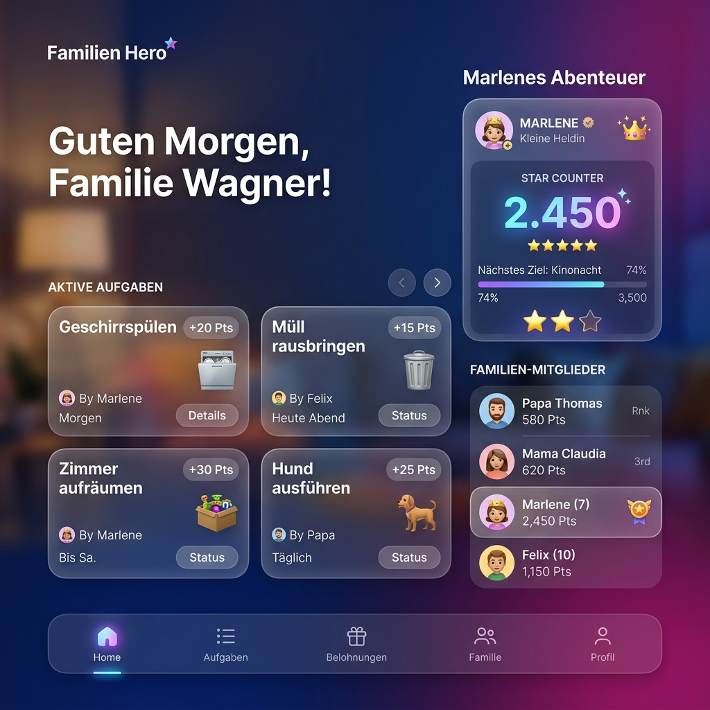
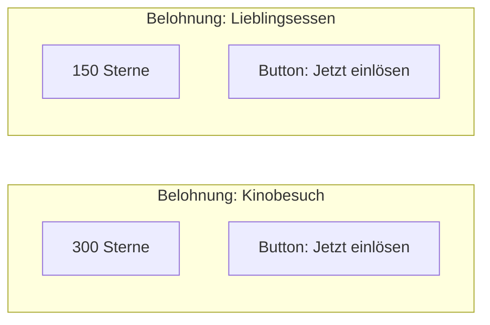

# Wireframes & UI-Design: Familien Hero

Dieses Dokument visualisiert die geplanten Oberflächen der Anwendung "Familien Hero". Der Fokus liegt auf einer intuitiven, spielerischen Benutzeroberfläche (Gamification).

## 1. Dashboard (Hauptansicht)
Das Dashboard bietet eine schnelle Übersicht über alle relevanten Kennzahlen und Familienmitglieder.



### Kern-Elemente:
- **Stats Grid (Kacheln):** Drei prominente Kacheln oben:
  1. Anzahl der "Offenen Aufgaben"
  2. "Marlenes Super-Punkte" (inkl. Fortschrittsbalken zum nächsten Ziel, z.B. LEGO Set)
  3. Aktueller "API Status"
- **Die Helden der Familie:** Eine vertikale Liste aller registrierten Familienmitglieder (Stefan, Alexandra, Marlene) mit Avatar und Rolle.
- **Navigation:** Untere oder seitliche Navigationsleiste für schnelles Wechseln zwischen Home, Aufgaben, Belohnungen und Profil.

## 2. Aufgaben-Verwaltung (Wireframe)
Hier können Eltern neue Aufgaben anlegen und bearbeiten.

```mermaid
graph TD
    subgraph "Screen: Neue Aufgabe"
        T[Titel der Aufgabe]
        D[Beschreibung]
        P[Punkte-Wert (Dropdown: 5, 10, 20, 50)]
        U[Zuweisung an Helden (Dropdown)]
        B[Button: Heldentat anlegen]
    end
```

## 3. Belohnungsshop (Wireframe)
In diesem Bereich können die gesammelten Punkte "ausgegeben" werden.



## 4. Design-Vorgaben
- **Farbpalette:** Sanfte Verläufe (Gradients), klares Weiß/Dunkelblau für hohen Kontrast.
- **Effekte:** Glassmorphism (transparente Hintergründe mit Blur-Effekt) für Karten und interaktive Elemente.
- **Typography:** Moderne, abgerundete serifenlose Schriftart (z.B. Outfit oder Inter).
- **Icons:** Verwendung von Emojis oder flachen Illustrationen zur Visualisierung der Aufgaben.
